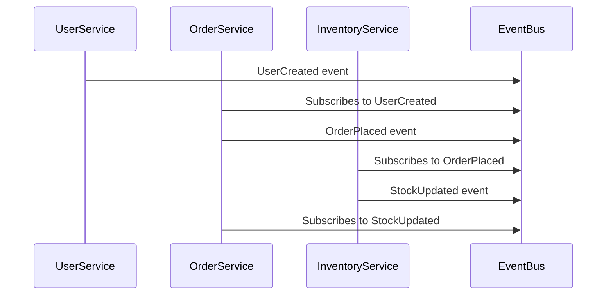

# Advanced Microservices Communication and Event-Driven Architectures

If you've ever wrestled with microservices that are tightly coupled—or spent countless hours debugging cascading failures triggered by one failing service—you know how critical communication design is for scalable systems. What if your microservices never called each other directly, relying **solely** on events to stay in sync? Welcome to the world of fully decoupled, event-driven architectures, where services chat asynchronously over event buses, boosting resilience and scalability.

Today we'll explore this advanced pattern: its motivations, trade-offs, and how it transforms data handling in microservice ecosystems.

## The Problem: Tight Coupling in Microservices Communication

In many microservices systems, services call each other directly via HTTP REST APIs or RPC. Picture this:

- Service A calls Service B to retrieve data.
- Service B calls Service C to enrich its response.

Each direct call increases temporal coupling—if B or C is down, A’s request fails or becomes sluggish. This cascading effect impacts system reliability and user experience.

Developers add circuit breakers and retries, but often the underlying synchronous dependency remains. This setup hampers scalability and complicates fault isolation.

## Enter: Event-Driven Architectures with an Event Bus

Event-driven architectures (EDA) replace direct calls with **asynchronous events** broadcast over an event bus like Apache Kafka, NATS, or RabbitMQ. Services *publish* events representing facts (e.g., `UserCreated`, `OrderPlaced`), and others *subscribe* to these events to update their state or trigger processing.

### What does full decoupling mean here?

- **No direct inter-service calls**—never REST or RPC between microservices.
- **One communication medium:** the event bus.
- **Services respond solely to domain events** they care about.

This eliminates temporal coupling; no service waits on another synchronously. In essence, microservices become autonomous event consumers and producers.


## Handling Data Duplication and Queries

A major challenge: if Service B needs data originally owned by Service A, it cannot just ask A via API or database query. Instead, B maintains a local copy updated through events.

For example, Service A emits a `UserCreated` event:

```json
{
  "eventType": "UserCreated",
  "data": {
    "userId": "1234",
    "name": "Alice",
    "email": "alice@example.com"
  },
  "timestamp": "2025-05-11T10:20:30Z"
}
```

Service B, interested in user data, subscribes to `UserCreated` and `UserUpdated` events, updating its own local database with the received info.

### Pros and Cons of This Approach

| Pros                                   | Cons                                      |
|---------------------------------------|-------------------------------------------|
| Services remain autonomous             | Data duplication and storage overhead     |
| Read operations are fast and local    | Eventual consistency (temporary stale data) |
| Eliminates synchronous dependencies   | Complexity in handling out-of-order or lost events |

Many teams accept data duplication because the benefits of independence, fault isolation, and scalability outweigh the overhead. Strong event delivery guarantees from platforms like [Apache Kafka](https://kafka.apache.org/documentation/) help maintain consistency.

## Real-World Scenario: Building a Resilient E-Commerce Platform

Imagine an e-commerce system with three main services:

- **User Service:** Manages user registration and profiles.
- **Order Service:** Processes orders.
- **Inventory Service:** Tracks stock levels.

### Event flow example:

1. **User Service** publishes a `UserCreated` event when a new customer signs up.
2. **Order Service** listens to `UserCreated` to update its local user database.
3. When a customer places an order, **Order Service** emits an `OrderPlaced` event.
4. **Inventory Service** consumes `OrderPlaced`, reduces stock accordingly, and publishes `StockUpdated`.
5. **Order Service** consumes `StockUpdated` to confirm inventory availability asynchronously.

These steps can be visualized as:



No service calls another directly. Each reacts asynchronously and can scale or fail independently without cascading disruptions.

## Conclusion

Shifting to fully event-driven communication with no direct calls marks a significant evolution in microservices architecture. It demands embracing eventual consistency and data duplication, but rewards architects with resilience, autonomy, and scalability.

Debugging tightly coupled microservices is like spelunking without a map: frustrating and error-prone. Event-driven architectures hand you the GPS—empowering you to build scalable, fault-tolerant systems that gracefully evolve.

---

### References

- Martin Fowler, "[Event-Driven Architecture](https://martinfowler.com/articles/201701-event-driven.html)"
- Apache Kafka Documentation: https://kafka.apache.org/documentation/
- NATS.io: https://nats.io/

---

#Hashtags

#microservices #eventdriven #architecture #scalability #softwaredesign