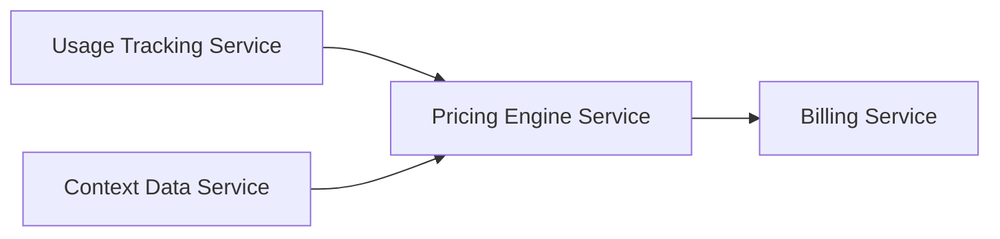

# Dynamische Kostenaanpassing in Microservices: Realtime Reageren op Vraag en Gebruik

In de wereld van moderne softwarearchitectuur winnen microservices als concept snel terrein. Hun flexibiliteit, schaalbaarheid en onafhankelijkheid maken het mogelijk grote systemen modulair en efficiënt te ontwerpen. Maar deze voordelen gaan verder dan alleen technische implementatie: microservices stellen organisaties ook in staat om bedrijfslogica op nieuwe manieren toe te passen. Eén zo'n innovationele toepassing is **dynamische kostenaanpassing** — een patroon waarbij microservices prijzen of kosten real-time aanpassen op basis van klantinteracties en contextuele informatie.

## Waarom Dynamische Kostenaanpassing?

Stel je voor: een streamingdienst die afhankelijk van je kijkgedrag en netwerkcondities de prijs per maand aanpast, of een e-commerceplatform dat prijzen aanpast op basis van voorraadniveaus en gebruikersgedrag. Dit soort flexibele prijsstrategieën vereisen een systeem dat continu data verzamelt, analyseert en snel reageert.

Met traditionele monolithische applicaties zou zo’n responsieve aanpassing traag en complex zijn. Microservices daarentegen kunnen speciaal ontworpen worden om snel dynamische businessregels toe te passen, en doen dat vaak zonder andere componenten te beïnvloeden.

De belangrijkste voordelen:

- **Realtime aanpassing:** Prijzen worden direct aangepast op basis van actuele data.
- **Flexibiliteit:** Verschillende microservices kunnen verschillende prijsmodellen hanteren.
- **Schaalbaarheid:** Bij grote gebruikersaantallen kan de belasting verdeeld worden.
- **Betere gebruikerservaring:** Prijzen kunnen soepeler afgestemd worden op individuele klantbehoeften.

## Het Scenario: Een SaaS Platform met Dynamische Prijsmodellen

Laten we een praktisch scenario schetsen. Stel je een SaaS-platform voor dat gebruikers toegang biedt tot verschillende diensten (storage, compute, API-calls, etc.). Het platform wil een dynamisch prijsmodel invoeren dat rekening houdt met:

- Gebruikspatronen per klant
- Tijd van de dag (bijv. daluren goedkoper)
- Regionale factoren (lokale aanbieders, wisselkoersen)
- Concurrentieprijzen en marktdruk

### Architectuur Overwegingen

Een mogelijke microservices opzet:

- **Usage Tracking Service:** Verzamelt data over het gebruik per klant.
- **Pricing Engine Service:** Berekent dynamisch de prijs aan de hand van de data en vooraf gedefinieerde regels.
- **Billing Service:** Zorgt voor facturatie en integratie met betaalproviders.
- **Context Data Service:** Verzamelt externe data — zoals marktprijzen en regionale informatie.

Deze services communiceren via asynchrone berichten (bijvoorbeeld Kafka) om schaalbaarheid en beschikbaarheid te waarborgen.



*Figuur 1 - Communicatie tussen microservices voor dynamische kostenaanpassing*

## Uitdagingen en Trade-offs

### 1. Consistentie en Synchronisatie

Prijzen moeten consistent zijn over alle klantinteracties. Tegelijkertijd zijn microservices meestal eventual consistent. Trade-off:

- Gebruik event sourcing en CQRS om consistentie te behouden zonder performanceverlies.
- Maak gebruik van lokale caches binnen services, maar vernieuw die frequent.

### 2. Latentie en Performance

Realtime prijsaanpassing vereist snelle reactietijden. Dit vereist:

- Geoptimaliseerde queries in pricing services.
- Eventueel gebruik van in-memory databases zoals Redis.
- Asynchrone verwerking voor minder kritische updates.

### 3. Complexiteit in Regels en Beheer

Het ontwikkelen en onderhouden van dynamische prijsregels kan snel complex worden:

- Gebruik van declaratieve regelsystemen (bijv. Drools) of policy engines.
- Ontwikkel een user interface voor niet-technische medewerkers om prijsstrategieën te beheren.

### 4. Veiligheid en Fraude

Prijzen aanpasbaar maken kan misbruikt worden:

- Strenge authenticatie en autorisatie op prijswijzigingen.
- Monitoring en alerts bij afwijkend prijsgedrag.

## Praktische Voorbeelden

### Netflix en Amazon

Beide reuzen passen dynamische prijzen en aanbiedingen toe, gebaseerd op gebruikersdata en marktcondities.

### Taxi-Apps (zoals Uber)

Dynamic pricing gebaseerd op vraag en aanbod en tijdstip is een bekend voorbeeld van realtime kostenaanpassing.

## Codevoorbeeld: Pricing Engine in Node.js

```javascript
class PricingEngine {
  constructor(rules) {
    this.rules = rules;
  }

  calculatePrice(basePrice, context) {
    let price = basePrice;
    this.rules.forEach(rule => {
      if (rule.condition(context)) {
        price = rule.adjust(price, context);
      }
    });
    return price;
  }
}

const rules = [
  {
    condition: (ctx) => ctx.time > 18 && ctx.time < 22,
    adjust: (price) => price * 1.2 // avondtarief 20% duurder
  },
  {
    condition: (ctx) => ctx.region === 'EU',
    adjust: (price) => price * 0.9 // EU-korting 10%
  }
];

const pricingEngine = new PricingEngine(rules);
const finalPrice = pricingEngine.calculatePrice(100, { time: 19, region: 'EU' });
console.log(`Finale prijs: €${finalPrice}`);
```

*Listing 1 - Eenvoudige regels voor dynamische prijsaanpassing*

## Monitoring en Feedbackloops

Om te zorgen dat de kostendynamiek effectief is, moeten services continu gemonitord worden:

- Gebruik dashboards voor real-time KPIs (prijsvariaties, klantfeedback).
- Implementeer feedbackloops waar AI of machine learning voorstellen voor nieuwe prijsstrategieën doet.

## Conclusie

Dynamische kostenaanpassing binnen een microservicesarchitectuur biedt krachtige mogelijkheden om real-time in te spelen op veranderende vraag en klantgedrag. Door gebruik te maken van gespecialiseerde microservices, flexibele communicatiepatronen en slimme regelengines kunnen organisaties veel beter concurreren en beter aansluiten bij individuele gebruikersbehoeften.

De uitdaging ligt in het balanceren van snelheid, consistentie en complexiteit, maar met een doordachte architectuur en moderne tooling is het bereiken van deze flexibiliteit zeker haalbaar.

---


---

## Bronnen

- [Microservices Architecture - Martin Fowler](https://martinfowler.com/articles/microservices.html)
- [Dynamic Pricing Strategies — Harvard Business Review](https://hbr.org/2020/05/using-dynamic-pricing-to-compete-in-an-online-world)
- [Apache Kafka Documentation](https://kafka.apache.org/documentation/)

---

*Geschreven door Andy van Dongen*