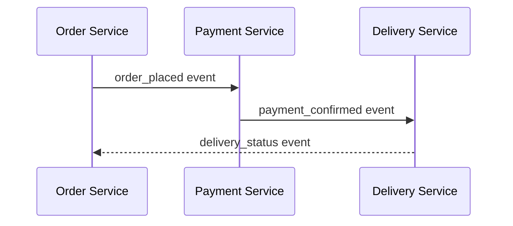

# Advancements and Challenges in Cloud-Native and Serverless Architectures

Imagine building applications in a world where servers are invisible, components talk through events like a well-coordinated orchestra, and your workloads stretch seamlessly across clouds and data centers. Welcome to the evolving realm of **cloud-native and serverless architectures**. These technologies promise agility and scalability but also bring their own set of puzzles and pitfalls.

In this article, we'll unpack four vital areas shaping this landscape: event-driven microservices, AWS Lambda's media processing constraints, Kubernetes management across hybrid clouds with Azure Arc, and the tricky art of securing serverless and cloud-native systems. Whether you're just starting or have years under your belt, this journey offers insights to sharpen your architecture toolkit.

## 1. Event-Driven Microservices: Orchestrating the Chaos

At the heart of modern cloud-native apps lies the event-driven pattern—a shift from rigid request-response flows to asynchronous conversations among microservices. This design promotes loose coupling and resilience but takes coordination to an art form.

### Challenges

- Managing asynchronous workflows scattered across services requires vigilant observability.
- Debugging event cascades can feel like *spelunking without a map*—echoes from every direction but no clear path.

### Innovations and Patterns

- Platforms like Apache Kafka, AWS EventBridge, and Google Cloud Pub/Sub provide robust event streaming backbones.
- The trend is moving from **orchestration**—where a central conductor directs services—to **choreography**, where each microservice independently responds to events.

### Example: Choreography vs Orchestration Explained

Consider a food delivery app:

- **Orchestration:** A central controller tells the order, payment, and delivery services exactly what to do and when.
- **Choreography:** Each service listens for events—like *order placed* or *payment confirmed*—and acts accordingly without direct commands.

Here's a Mermaid diagram illustrating this choreography interaction:



Such decentralization reduces single points of failure and scales more organically.

## 2. AWS Lambda and the Media Processing Bottleneck

Serverless pioneers love AWS Lambda for its instant scaling and pay-per-use model. But treating Lambda as a catch-all tool can hit a wall—especially with compute-hungry media workloads like video transcoding.

### Limitations

- Lambda’s max memory cap (10 GB) and 15-minute execution limit challenge intensive tasks.
- Cold start latency disrupts real-time media workflows needing high responsiveness.

### Workarounds and Alternatives

- **Specialized Managed Services:** AWS MediaConvert is designed specifically for batch media transcoding.
- **Edge Processing:** Lambda@Edge runs Lambda functions nearer users to reduce latency.
- **Containerized Serverless Platforms:** AWS Fargate allows running containerized workloads with serverless ease, accommodating heavier dependencies and longer tasks.

> Containerized serverless options let you bundle complex media processing libraries, bypass Lambda’s restrictions, and dodge the headache of managing servers.


## 3. Kubernetes Meets Azure Arc: Hybrid and Multi-Cloud Realities

While Kubernetes standardizes container orchestration, managing multiple clusters spanning on-premises and clouds blends art and science. Enter **Azure Arc**, which extends Kubernetes control planes for unified management.

### Benefits

- Central governance and policy enforcement for clusters everywhere.
- Consistent application deployments regardless of location.

### Challenges

- Network latency and configuration can ruffle multi-cluster communication.
- Authentication and role-based access control (RBAC) must be carefully synchronized across environments.


## 4. Authentication and Authorization: Securing Serverless and Cloud-Native Systems

Security is not an afterthought—it's woven deeply into ephemeral, distributed architectures where components appear and vanish fluidly.

### Complexities

- Short-lived serverless functions complicate token expiry and session tracking.
- Distributed systems require granular, context-aware policies enforced consistently.

### Strategies with Practical Example

- Implement **OAuth 2.0** and **OpenID Connect** for federated identities.
- Embrace **zero-trust security**: verify every identity, every time.
- Use service meshes like Istio to weave authentication and authorization into the application fabric.

Below is a simple Python example demonstrating token validation inside a serverless function:

```python
# Serverless function handler that validates JWT tokens
def lambda_handler(event, context):
    token = event['headers'].get('Authorization')
    if not validate_jwt(token):
        return {'statusCode': 401, 'body': 'Unauthorized'}
    # Proceed with authorized logic
    return {'statusCode': 200, 'body': 'Success'}

def validate_jwt(token):
    # Basic validation stub - production should verify signature, expiration, scopes, etc.
    return token == "Bearer valid-token"
```

> "Security in serverless architectures is like locking the door in a house where rooms appear and vanish dynamically—you need smart, flexible locks."

## Conclusion and Next Steps

Cloud-native and serverless architectures usher in agility and scalability, but require careful navigation through orchestration nuances, resource limits, multi-cloud governance, and layered security.

To master this terrain:

1. Adopt event-driven designs with robust monitoring.
2. Combine serverless with specialized and containerized services for heavy workloads.
3. Employ hybrid cloud tools like Azure Arc for cohesive operations.
4. Build security in from the start using modern identity frameworks and zero-trust principles.

Continue diving into these topics with these essential resources:

- [AWS Lambda Developer Guide](https://docs.aws.amazon.com/lambda/latest/dg/welcome.html)  
- [Azure Arc Documentation](https://learn.microsoft.com/en-us/azure/azure-arc/)  
- [Istio Service Mesh](https://istio.io/latest/docs/)  
- [OAuth 2.0 Overview](https://oauth.net/2/)  

---

## References

- [AWS Lambda Limits](https://docs.aws.amazon.com/lambda/latest/dg/gettingstarted-limits.html)  
- [Apache Kafka](https://kafka.apache.org/)  
- [Azure Arc overview](https://azure.microsoft.com/en-us/services/azure-arc/)  
- [OAuth 2.0 and OpenID Connect](https://oauth.net/2/)  
- [Istio Service Mesh](https://istio.io/latest/docs/)  

---

#CloudNative #Serverless #Kubernetes #AWSLambda #Security