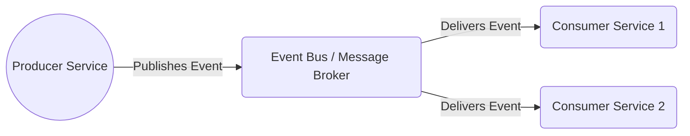

# Advanced Patterns and Challenges in Microservices Architecture

Modern software development increasingly relies on microservices to improve scalability and agility. Yet, moving from a monolithic architecture to microservices introduces complexity that can trip teams up—especially when services must communicate reliably and evolve independently. Addressing real-world issues such as brittle dependencies, service lookups, and scalable communication is essential for success.

This article dives into **advanced microservices architecture patterns**, spotlighting **event-driven microservices** communication through event buses to loosely couple components. We then unpack challenges in **dependency management** and **service discovery**, with a particular eye on the **Spring Cloud ecosystem**, providing practical examples for developers at all levels.

## The Event-Driven Communication Pattern in Microservices

Consider a busy airport: multiple teams operate independently, yet a central announcement system broadcasts timely messages that everyone listens to and reacts upon. Event-driven microservices rely on a similar principle—services publish events that interested services consume asynchronously.

### What Is Event-Driven Architecture (EDA)?

In EDA, services produce events emitted to a message broker or event bus. Other services subscribe to events of interest and react at their own pace. This asynchronous style enables better decoupling compared to direct synchronous calls.

**Benefits of Event-Driven Microservices include:**

- **Loose coupling:** Services avoid hard dependencies on each other’s availability.
- **Scalability:** Brokers like Kafka support high-throughput event streams partitioned across clusters.
- **Resilience:** Failed consumers don’t block event producers or other consumers.

Here is a simplified diagram illustrating this flow:



### Common Event Bus Technologies

- **Apache Kafka** — distributed, durable streaming platform ideal for event sourcing and stream processing.
- **RabbitMQ** — flexible broker with advanced routing capabilities.
- **Cloud providers** — AWS SNS/SQS, Azure Service Bus offer managed messaging services.

### Event-Driven Communication in Spring Cloud Stream

Spring Cloud Stream abstracts messaging middleware, allowing seamless integration with Kafka and RabbitMQ. Below is an example event producer that sends string payloads asynchronously:

```java
// Enables binding to output channel for message publishing
@EnableBinding(Source.class)
public class EventProducer {
    private final MessageChannel output;

    public EventProducer(Source source) {
        this.output = source.output();
    }

    // Sends a string event payload asynchronously
    public void sendEvent(String eventPayload) {
        output.send(MessageBuilder.withPayload(eventPayload).build());
    }
}
```

This approach encapsulates message broker specifics, facilitating portability and reducing boilerplate.

## Dependency Management Challenges in Microservices

Managing how services depend on each other can feel like juggling balls—dropping one creates a domino effect.

### Common Issues

- **Service version mismatch:** Independent deployments can break API compatibility.
- **Tight coupling risk:** Synchronous calls introduce brittle connections between services.

### Best Practices

- Use **Semantic Versioning** to distinguish breaking and backward-compatible changes clearly.
- Employ **Consumer-Driven Contracts** with tools like [Pact](https://docs.pact.io/) to verify API compatibility via tests driven by consumers.
- Favor **Backward Compatibility** by adding new API endpoints and deprecating older ones gradually.

## Service Discovery Challenges with Spring Cloud

In microservices, mapping a service name to a network location dynamically is critical.

### Using Eureka in Spring Cloud

Eureka servers act as registries where services register on startup and query lookup info dynamically.

```yaml
spring:
  application:
    name: inventory-service
  cloud:
    discovery:
      enabled: true
      service-id: inventory-service
```

### Common Problems

- **Stale Service Registrations:** Crashed services can linger in the registry, causing request failures.
- **Configuration Complexity:** Integrations with load balancers like Ribbon or Spring Cloud LoadBalancer require careful setup.
- **Latency Overhead:** Lookup requests add network hops impacting response times.

### Mitigations

- Implement lease renewal and periodic health checks to purge stale entries.
- Use circuit breakers like [Resilience4j](https://resilience4j.readme.io/docs/circuitbreaker) to gracefully handle failure cascades.

## Conclusion and Next Steps

Mastering advanced microservices requires adopting event-driven patterns for scalable, decoupled communication, along with vigilant dependency and service discovery management. The Spring Cloud ecosystem provides powerful capabilities but demands thoughtful configuration and operational discipline.

**Key takeaways:**

- Experiment with Spring Cloud Stream to build event-driven services backed by Kafka or RabbitMQ.
- Integrate consumer-driven contract testing into your CI/CD pipelines.
- Configure Eureka and leverage circuit breakers to enhance service resilience.

Building microservices is like conducting a symphony—each instrument plays independently but combines in harmony to create a masterpiece.

---

### References

- [Martin Fowler on Microservices](https://martinfowler.com/articles/microservices.html)
- [Spring Cloud Documentation](https://spring.io/projects/spring-cloud)
- [Apache Kafka Documentation](https://kafka.apache.org/documentation/)
- [Pact Consumer Driven Contracts](https://docs.pact.io/)
- [Resilience4j Circuit Breaker](https://resilience4j.readme.io/docs/circuitbreaker)

---

### Images


